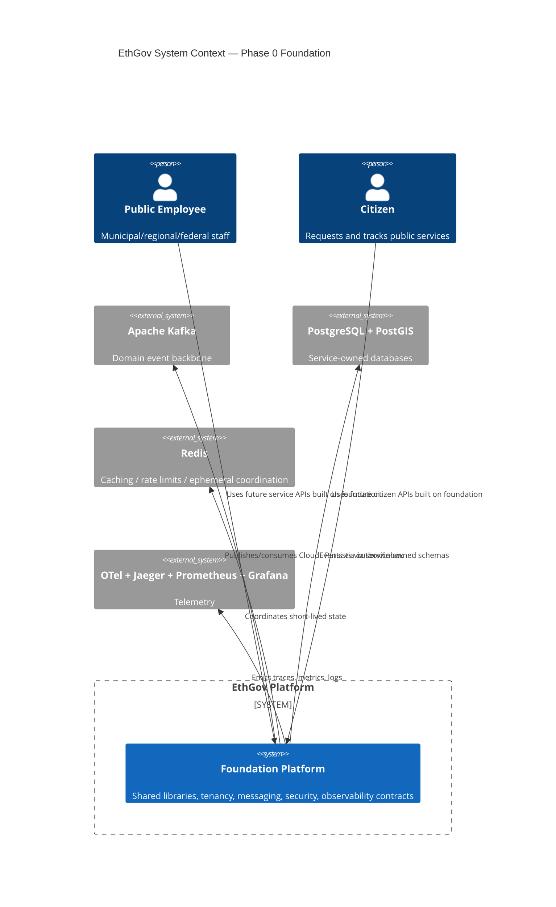

# EthGov C4 — Context (Phase 0)

```mermaid
C4Context
title EthGov System Context — Phase 0 Foundation

Person(clerk, "Public Employee", "Municipal/regional/federal staff")
Person(citizen, "Citizen", "Requests and tracks public services")
System_Boundary(ethgov, "EthGov Platform") {
  System(platform, "Foundation Platform", "Shared libraries, tenancy, messaging, security, observability contracts")
}
System_Ext(kafka, "Apache Kafka", "Domain event backbone")
System_Ext(pg, "PostgreSQL + PostGIS", "Service-owned databases")
System_Ext(redis, "Redis", "Caching / rate limits / ephemeral coordination")
System_Ext(otel, "OTel + Jaeger + Prometheus + Grafana", "Telemetry")

Rel(clerk, platform, "Uses future service APIs built on foundation")
Rel(citizen, platform, "Uses future citizen APIs built on foundation")
Rel(platform, kafka, "Publishes/consumes CloudEvents via outbox/inbox")
Rel(platform, pg, "Persists via service-owned schemas")
Rel(platform, redis, "Coordinates short-lived state")
Rel(platform, otel, "Emits traces, metrics, logs")
```

Phase 0 does not expose business APIs. It establishes the contracts later services implement.
